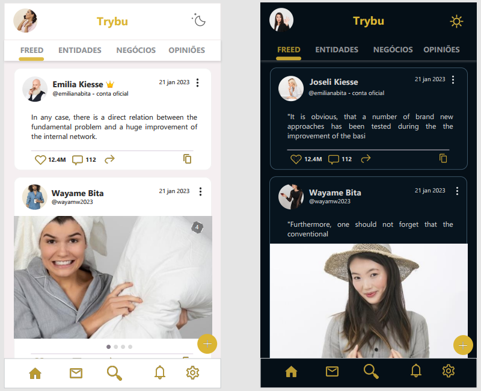
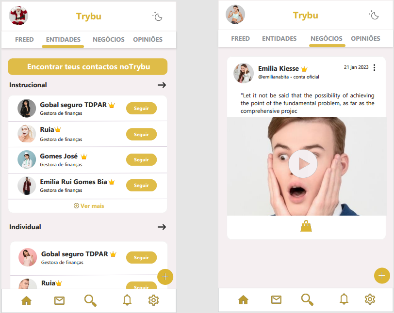
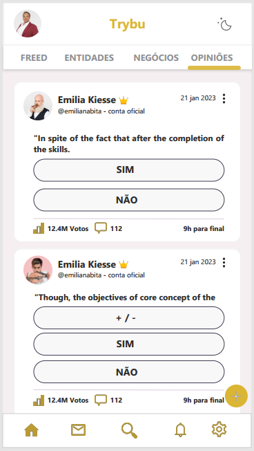
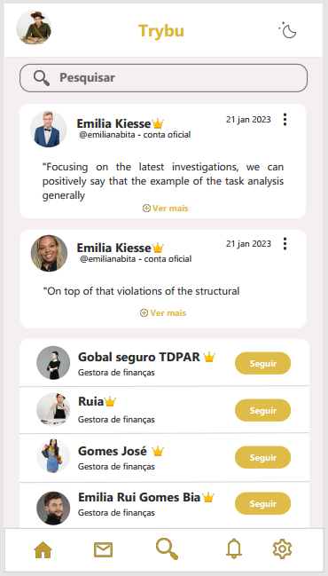
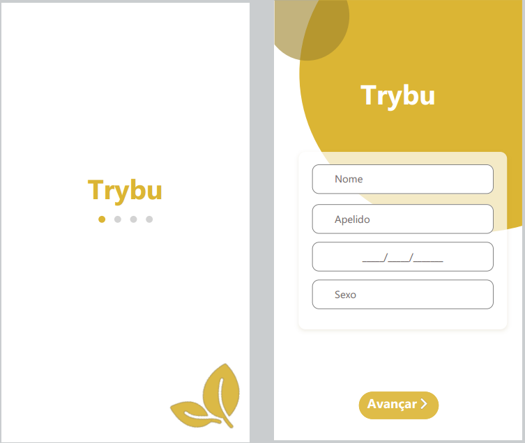
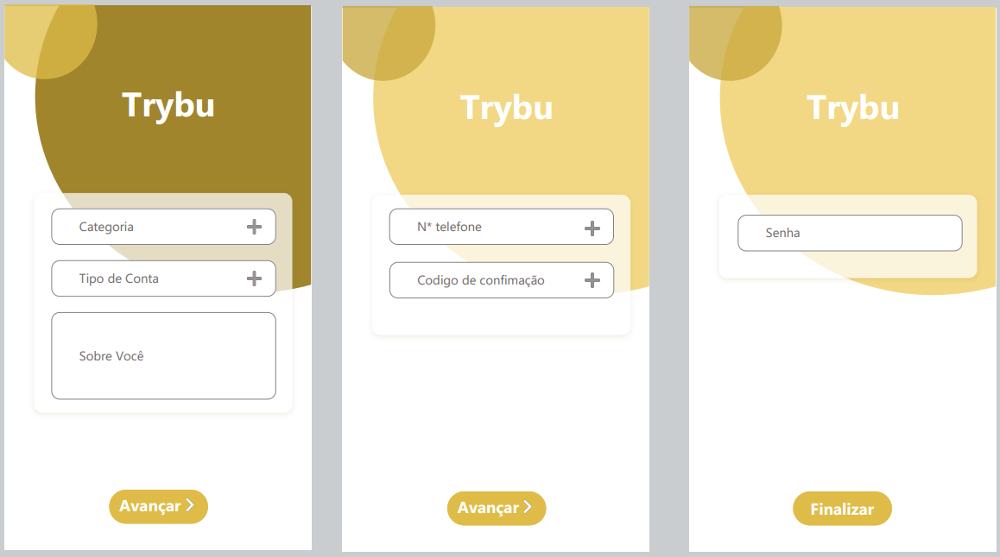

# PITCH - Grupo Nº 4

Arquivos

[Layout](files/0.pdf) | 
[Cadastro](files/Cadastrar.pdf) |
[Pitch](files/Pitch%20(3).pdf) | 
[Simulação](video/Simula%C3%A7%C3%A3o%20do%20app.mp4) |
[Download do app](.apk/app-trybu.apk)

# Sumário

* [Resumo](#resumo)
* [Impacto-Social](#impacto-social)
* [Tecnologias-Utilizadas](#tecnologias-utilizadas)
* [Ciclo-de-Vida-do-App](#ciclo-de-vida-do-app)
* [Layout](#layout)
* [Melhorias-do-App](#melhorias-do-app)

### Resumo

A **trybu** nasceu da ideia de que existem diversos tipos
únicos de públicos.
Este conceito trybu, foi criado por mulheres que um
dia atreveram-se a sonhar.
Com a criação da app **ELA Empreende**, veio para
agregar valor às empreendedoras.

### Impacto-Social

- Motivação para as mulheres empreenderem
- Criar redes de empreendedoras
- Estar passo a passo com o cliente

### Tecnologias-Utilizadas

|LINGUAGENS | FRAMEWORK | FERRAMENTAS|
-|-|-|
Dart | Flask | Visual Code
MySQL | Flutter | Lunacy
Python | | Github

### Ciclo-de-Vida-do-App

### Layout

### Melhorias-do-App

- Criar um CRM para aplicação
- Integrar AWS Cloud para infraestrutura e soluções
escaláveis para computação armazenamento, banco
de dados, análises e muito mais.
